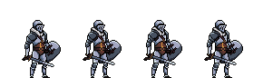
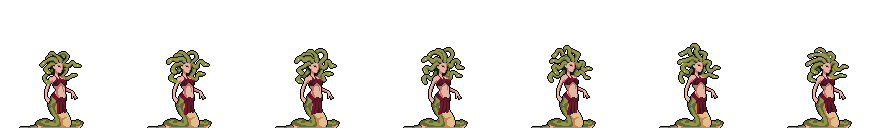
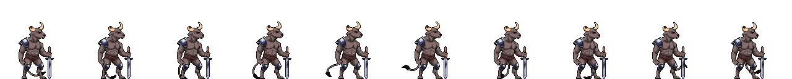

- [**Memoria del Videojuego - Proyecto en Godot**](#memoria-del-videojuego---proyecto-en-godot)
  - [**1. Conceptualización**](#1-conceptualización)
    - [**1.1. Introducción**](#11-introducción)
    - [**1.2. Mecánicas del Juego**](#12-mecánicas-del-juego)
    - [**1.3. Objetivo del Juego**](#13-objetivo-del-juego)
    - [**1.4. Story Board**](#14-story-board)
  - [**2. Arte**](#2-arte)
    - [**2.1. Diseño de Personajes**](#21-diseño-de-personajes)
    - [**2.2. Objetos y coleccionables**](#22-objetos-y-coleccionables)
    - [**2.3. Fondos y Escenarios**](#23-fondos-y-escenarios)
    - [**2.4. UI y Elementos Visuales**](#24-ui-y-elementos-visuales)
  - [**3. Programación**](#3-programación)
    - [**3.1. Estructura del Proyecto**](#31-estructura-del-proyecto)
    - [**3.1. Estructura del Proyecto**](#31-estructura-del-proyecto-1)
    - [**3.2. Mecánicas Implementadas**](#32-mecánicas-implementadas)
  - [**4. Elementos destacables del desarrollo**](#4-elementos-destacables-del-desarrollo)
    - [**4.1. Innovaciones**](#41-innovaciones)
    - [**4.2. Problemas y Soluciones**](#42-problemas-y-soluciones)
  - [**5. Recursos Utilizados**](#5-recursos-utilizados)
    - [**5.1. Fuentes y Assets**](#51-fuentes-y-assets)
    - [**5.2. Enlaces de Referencia**](#52-enlaces-de-referencia)

# **Memoria del Videojuego - Proyecto en Godot**

## **1. Conceptualización**

### **1.1. Introducción**
El videojuego es una **aventura de acción en 2D** en la que un **caballero medieval** debe viajar entre **diferentes mundos** enfrentándose a enemigos temibles para **rescatar a su amada**. La historia se desarrolla en un entorno fantástico donde el protagonista deberá superar múltiples desafíos, enfrentarse a criaturas hostiles y encontrar las runas que le permitirán avanzar en su misión.

### **1.2. Mecánicas del Juego**
- **Movimiento del personaje:** el personaje podrá moverse a la izquierda, derecha y saltar (A + W + D + SPACE).
- **Coleccionables:** monedas y runas que otorgan mejoras o puntos al jugador.
- **Enemigos con IA:** patrones de ataque y movimiento distintos según el tipo de enemigo.

### **1.3. Objetivo del Juego**
El objetivo del juego es guiar al caballero a través de diversos mundos, derrotando enemigos y recolectando runas que desbloquean nuevas puertas hasta llegar al enfrentamiento final con el dragón. Solo al vencerlo podrá encontrar y rescatar a su amada.

### **1.4. Story Board**
A continuación, se adjunta un documento PDF con el **Story Board** del videojuego, donde se representan las escenas clave y el flujo de la historia visualmente.

**Ver Story Board:** [Haz clic aquí](../Arcane%20Hunter/conceptualizacion/Boords.pdf)

---

## **2. Arte**

### **2.1. Diseño de Personajes**
- El protagonista es un **caballero medieval**, con animaciones detalladas para moverse, saltar y recoger objetos.
  
- **Enemigos** como la **gorgona y el minotauro** tienen diferentes estilos visuales y animaciones de ataque (`attack`) y patrullaje (`walk`).
  
  
- Se utilizaron **spritesheets** para crear animaciones fluidas y efectos visuales atractivos.
- Se aplicaron variaciones de enemigos para añadir diversidad en los combates.

### **2.2. Objetos y coleccionables**
- **Monedas** y **runas** tienen diseños únicos y se pueden recolectar por el escenario.
  
  
- **Cofres animados**: Diseñados para abrirse automáticamente al acercarse el jugador.  
  
- **Cajas, barriles y otros objetos del entorno** presentan físicas de colisiones.
  

### **2.3. Fondos y Escenarios**
- El primer mundo tiene un **entorno único**, con fondos en **parallax** para generar profundidad.
- Se han aplicado **tilesets** modulares para crear niveles personalizables y dinámicos.
- Diferentes tipos de terreno y plataformas permiten mayor variedad en la jugabilidad.

### **2.4. UI y Elementos Visuales**
- **Menús**, con sonido, selección de botones sencilla y un estilo único. Se presentan dos menús, uno de inicio y otro de selección de niveles.
- **Contadores de monedas y runas con animaciones**, con un diseño distintivo para facilitar la comprensión del jugador.
- **Diseño de botones y HUD** adaptado al estilo visual del juego.

---

## **3. Programación**

### **3.1. Estructura del Proyecto**
El proyecto está organizado en varias carpetas para una mejor gestión de los archivos:

### **3.1. Estructura del Proyecto**

El proyecto está organizado en varias carpetas para una mejor gestión de los archivos:

- **`res://environment/`** → Contiene todos los recursos relacionados con el entorno del juego.
  - **`res://environment/music/`** → Archivos de música utilizados en el juego.
  - **`res://environment/object_resources/`** → Recursos gráficos y animados utilizados en los escenarios.
    - **`counters/`** → Contadores de monedas y runas utilizados en la UI.
    - **`tileset/`** → Tilesets utilizados para la creación de los niveles.
    - **`tileset_medieval/`** → Tilesets de temática medieval descargados, no utilizados en esta versión.
  - **`res://environment/scenes/`** → Contiene las escenas principales del juego.
    - `background.tscn` → Escena de fondo del nivel con efecto parallax.
    - `end_level.tscn` → Área de detección del final del nivel.
    - `environment.tscn` → Escena principal del nivel con su estructura base.
    - `floor.tscn` → Escena del suelo y plataformas del nivel.
  - **`res://environment/scripts/`** → Scripts relacionados con el entorno del nivel.

- **`res://characters/`** → Contiene las escenas, scripts y recursos gráficos de los personajes.
  - **`player/`** → Carpeta del personaje principal (caballero).
    - **`object_resources/`** → Sprites y animaciones del personaje principal.
      - `Knight_1`, `Knight_2`, `Knight_3` → Spritesheets de diferentes versiones del caballero.
      - **`Spritesheet 128/`** → Sprites en resolución 128px para animaciones.
    - **`scenes/`** → Contiene la escena del personaje principal en Godot.
    - **`script/`** → Lógica del jugador.
    - **`sounds/`** → Sonidos asociados al caballero (pasos, ataque, daño).
  - **`ene_dyn/`** → Carpeta que contiene los enemigos dinámicos del juego.
    - **`gorgon/`** → Contiene los recursos de la Gorgona.
      - **`Gorgon_1, Gorgon_2, Gorgon_3/`** → Variantes de sprites de la Gorgona.
      - **`scenes/`** → Contiene la escena del enemigo en Godot.
      - **`scripts/`** → Código que controla su IA y comportamiento.
    - **`minotaur/`** → Contiene los recursos del Minotauro.
      - **`Minotaur_1, Minotaur_2, Minotaur_3/`** → Variantes de sprites del Minotauro.
      - **`scenes/`** → Escena del Minotauro en Godot.
      - **`scripts/`** → Código que maneja su IA y comportamiento.

- **`res://menus/`** → Contiene los menús principales del juego.
  - **`menu/`** → Carpeta del menú de inicio.
    - **`img/`** → Contiene imágenes usadas en la interfaz del menú.
    - **`music/`** → Música utilizada en el menú.
    - **`scene/`** → Escena principal del menú de inicio.
      - `menu.tscn` → Escena del menú inicial.
    - **`script/`** → Lógica del menú principal.
    - **`text_resource/`** → Tipografía utilizada en los menús.
  - **`menu_selection/`** → Carpeta del menú de selección de niveles.
    - **`img/`** → Imágenes utilizadas en la selección de niveles.
    - **`music/`** → Música utilizada en la selección de niveles.
    - **`scene/`** → Escena del menú de selección.
      - `menu_selection.tscn` → Escena de la selección de nivel.
    - **`script/`** → Lógica del menú de selección.
    - **`text_resource/`** → Tipografía utilizada en la selección de niveles.

- **`res://environment/object_resources/tileset/4 Animated objects/`** → Objetos interactivos con animaciones.
  - **`audio/`** → Efectos de sonido de los objetos animados.
  - **`img/`** → Sprites animados de los objetos.
  - **`scenes/`** → Escenas de los objetos animados.
  - **`scripts/`** → Lógica de los objetos animados.

- **`project.godot`** → Archivo de configuración del motor Godot, donde se definen las propiedades globales del proyecto.

Aquí podrás observar la composición y sentido de las escenas más importantes sobre los objetos:

- **El jugador (`Player.tscn`)**:
  - `CharacterBody2D`: Maneja la física del movimiento.
  - `AnimatedSprite2D`: Controla las animaciones de pasivo, correr, saltar y morir.
  - `CollisionShape2D`: Detecta colisiones con plataformas y enemigos.
  - `Camera2D`: Sigue al personaje en su desplazamiento.
  - `AudioStreamPlayer2D`: Reproduce sonido al morir.

- **Los enemigos (`gorgon/minotaur.tscn`)**:
  - `CharacterBody2D`: Define su movimiento.
  - `AnimatedSprite2D`: Contiene las animaciones de patrullaje y ataque.
  - `CollisionShape2D`: Para detección de colisiones con el jugador.
  - `Area2D`: Área de detección de ataque con el jugador.
  - `RayCast2D`: Detectores que indican el movimiento del enemigo.

- **Los coleccionables (`coin.tscn` y `rune.tscn`)**:
  - `RigidBody2D`: Controla la física de caída y rebote.
  - `AnimatedSprite2D`: Controla la animación de movimiento.
  - `CollisionShape2D`: Detecta colisiones con plataformas y jugador.
  - `Area2D`: Detecta cuándo el jugador recoge el objeto.
  - `AudioStreamPlayer2D`: Reproduce sonido al recoger el ítem.

- **Los cofres (`chest.tscn`)**:
  - `AnimatedSprite2D`: Controla la animación de movimiento.
  - `Area2D`: Detecta cuándo el jugador entra en el area de interacción.
  - `CollisionShape2D`: Detecta colisiones con plataformas y jugador.

---

### **3.2. Mecánicas Implementadas**
El juego incluye diversas mecánicas programadas que mejoran la jugabilidad:

- **Movimiento del jugador**:
  - Uso de `CharacterBody2D` con `move_and_slide()`.
  - Implementación de salto y gravedad personalizada.
  - Detección de colisiones con plataformas y enemigos.

- **IA de los enemigos**:
  - Patrullaje con cambio de dirección al detectar colisión.
  - Ataque al entrar en el área del jugador.
  - Reproducción de animaciones según estado (`walk`, `attack`).

- **Sistema de colisiones**:
  - Uso de `Area2D` para la detección de impacto con coleccionables.
  - `CollisionShape2D` para detectar el suelo y evitar caídas.

- **Animaciones**:
  - `AnimationPlayer` para gestionar transiciones suaves entre animaciones.
  - Animaciones de ataque, caminar y morir.

- **Coleccionables**:
  - Implementación de `RigidBody2D` para la física de caída de monedas y runas.
  - Contadores de monedas y runas visibles en la interfaz (`Label`).

- **Cofres interactivos con generación de objetos aleatorios**:
  - Se detecta la proximidad del jugador mediante un `Area2D`.
  - Al abrirse, genera entre 0 y 6 **monedas** de forma aleatoria (`randi_range(0,6)`).
  - Existe una **probabilidad del 1%** de soltar una **runa** (`randi_range(1,100) == 1`).
  - Se utiliza `apply_impulse(Vector2(randf_range(-100, 100), -150))` para dispersar las monedas y runas con físicas realistas.

- **Cambio de escenas**:
  - Implementado con `change_scene_to_file()`.
  - Se usa un `Area2D` al final del nivel para cambiar de escena.

- **Sistema de sonido**:
  - Efectos de sonido al recoger objetos (`AudioStreamPlayer2D`).
  - Música de fondo en el menú y durante la partida.

- **Reinicio del juego**:
  - Uso de `get_tree().reload_current_scene()` cuando el jugador muere.
  - Implementación de un temporizador para la animación de muerte antes del reinicio.

- **Cámara dinámica**:
  - Uso de `Camera2D` con **drag margins** para un seguimiento suave del personaje.
  - Ajustes de límites para evitar que la cámara muestre partes vacías del nivel.

---

## **4. Elementos destacables del desarrollo**

### **4.1. Innovaciones**
- **Cofres interactivos con generación aleatoria** de monedas y runas.
- **Sonido de muerte  y animación del personaje** que no se interrumpen al reiniciar la escena.
- **Área de detección para finalización del nivel**, permitiendo un flujo más dinámico en la jugabilidad.

### **4.2. Problemas y Soluciones**
| **Problema** | **Solución** |
|-------------|-------------|
| El sonido de las monedas y runas se cortaba al recogerlas. | Se usó `remove_child(audio)`, moviendo el sonido a la escena antes de eliminar el objeto. |
| Los cofres se podían abrir múltiples veces generando demasiadas monedas. | Se agregó una variable `abierto = false` para evitar que se activen más de una vez. |
|El juego reinicia directamente el nivel cuando el jugador muere sin antes realizar la animación `dead` o sonido.|Creación de un timer de X segundos para que al terminar este, la escena se reinicie dejando tiempo a la animación y sonido de poder ejecutarse|
|El jugador podía morir infinitamente desde ciertos puntos del entorno de manera que el enemigo se quedaba atascado entre el jugador y el límite del mapa atacándole una y otra vez.|Reducción del tiempo de animación y sonido de muerte|

---

## **5. Recursos Utilizados**

### **5.1. Fuentes y Assets**
A continuación, se listan los recursos gráficos, sonoros y tipográficos utilizados en el desarrollo del videojuego:

- **Sprites y Animaciones:**
  - Personaje principal
    - [https://craftpix.net/freebies/free-knight-character-sprites-pixel-art/?num=1&count=342&sq=medieval&pos=11](https://craftpix.net/freebies/free-knight-character-sprites-pixel-art/?num=1&count=342&sq=medieval&pos=11)
  - Gorgonas
    - [https://craftpix.net/freebies/free-gorgon-pixel-art-character-sprite-sheets/](https://craftpix.net/freebies/free-gorgon-pixel-art-character-sprite-sheets/)
  - Minotauros
    - [https://craftpix.net/freebies/free-minotaur-sprite-sheet-pixel-art-pack/](https://craftpix.net/freebies/free-minotaur-sprite-sheet-pixel-art-pack/)
- **Fondos y Tilesets:**
  - [https://craftpix.net/freebies/free-swamp-game-tileset-pixel-art/?num=2&count=121&sq=forest&pos=7](https://craftpix.net/freebies/free-swamp-game-tileset-pixel-art/?num=2&count=121&sq=forest&pos=7)
- **Efectos de Sonido:**
  - [https://pixabay.com/es/](https://pixabay.com/es/)
- **Música de Fondo:**
  - [https://pixabay.com/es/](https://pixabay.com/es/)

### **5.2. Enlaces de Referencia**
Estos son algunos de los recursos documentales y herramientas utilizadas en la producción del juego:

- **Documentación oficial de Godot:**  
  - [https://docs.godotengine.org](https://docs.godotengine.org)
- **Plataformas de sonidos y música:**  
  - [https://pixabay.com/es/](https://pixabay.com/es/)